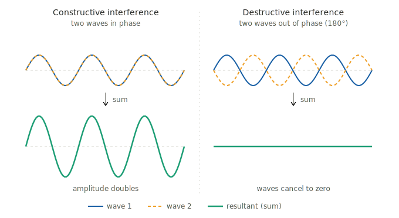
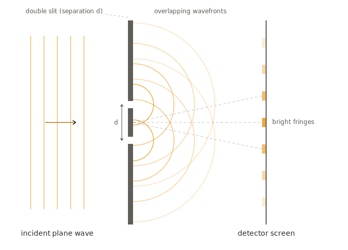

# The quantum double-slit experiment

## Part 1: the background

In this series we'll be using numerical and analytical methods for simulating
and solving for the result of the famous quantum mechanical [double-slit experiment](https://en.wikipedia.org/wiki/Double-slit_experiment),
performed with an electron and solved in a variety of different ways. As this is an advanced topic,
having some familiarity with calculus and perhaps basic classical [Lagrangian] mechanics will help a great deal.
That said, the accompanying derivations and code can be skipped if need be, and some calculations are omitted and left 
as an exercise for the reader in any case (cue sinister laugh).

I like this problem a lot, as it illustrates some really interesting quantum phenomena 
(wave-particle duality, superposition, interference, uncertainty, measurement), and you can layer on the complexity, 
as we'll do here in discrete and progressive steps.

### Classical picture: light

Many of you may know that light has both particle- and wave-like properties. A photon is an "atom" of light,
an indivisible and smallest packet of light that exhibits particle-like behavior.
However, light at a macroscopic level - and that which we encounter in our daily life - behaves as a wave. 
And waves exhibit two phenomena that are critical to understanding the double-slit experiment: 
_diffraction_ and _interference_.

#### Diffraction

If you shine a laser from a distance onto a piece of paper with a tiny little pinhole in the middle, most of the 
light will be absorbed or reflected by the surface of the paper, and some will make it through the hole. 
If you have a second piece of paper behind the first (call it the "detector screen"), you'll see that the transmitted 
light that goes through the hole spreads out a little bit. The dot on the paper on the detector screen will be slightly 
wider then the initial, incoming beam. The highest intensity of light on the detector will be in the center of the dot.
As you work your way outward from the center, the intensity decreases until it dies off. 
This spreading out is known as diffraction, and is due to light bending around the sides of the hole.

#### Interference

Waves are basically just oscillations of _something_, ups and downs in a repeating pattern. The peaks and troughs
of light correspond to peaks and troughs of electric and magnetic fields, but that's out of scope for this post. All
you need to know is that two beams of light that overlap will, generally, _interfere_. Roughly, when a peak 
overlaps with a peak, the intensity of the light increases. Same with a trough overlapping a trough. 
But when a peak and a trough overlap, they cancel each other out and you get no light at all.

#### Classical double-slit

Combining the above two concepts, take a look at the following diagram and first see if you can reason about
the result on your own.

Diffraction causes the bending of the light going through each slit, and interference causes the regions of high and
low intensity on the detector screen.

### Quantum picture: also with light

As I said before, light has both particle-like and wave-like behavior. Let's focus on the particle-like properties of
light now. When you dial down the intensity (brightness) of light, you're releasing fewer photons from the light source
over a certain timespan. You can make it so the light source is so dim that individual photons go through
at such a slow rate that each photon goes through the slit and hits the detector screen before the next photon starts
its journey. So how would we expect the light to behave? What would the pattern on the detector look like? 

Let's make our detector screen a theoretical, 2-dimensional screen that can detect where a single photon lands. When
the light is on full blast like in the above experiment, the detector will detect a large number of photons over a
given (short) timespan. The resulting pattern will exhibit wave interference, as we described before.

However, now dial down the light intensity to be sufficiently low that single photons arrive sequentially at the 
detector screen, passing through either the top or bottom slit (or... both or neither, as we'll see). 
Okay, so admittedly this is really a _semi-classical_ picture since 
we're dealing with individual photons. But hear me out. Classically,
we would expect the screen to have two blotches where the photons hit the screen, each directly, line-of-sight behind 
one of the slits. We wouldn't expect interference, since each photon passes through sequentially with no overlap. 

BUT, we in fact _do_ see the interference fringes on the screen, provided we don't set up a way to detect which
slit each photon went through. I'll get to the mathematics and maybe even philosophy of what happens when the
observer (us) detects which slit the photon passed through. But for now, take it as a given that this is the case.

We'll show mathematically that we get the same interference pattern with individual electrons. Disclaimer: the
derivations are pretty advanced and you can skip to the resulting plots to see what actually appears on the screen.

One note about measurement: even if we were to allow any quantum experiment exhibiting this interference phenomenon
to be carried out without actually measuring anything, if it were possible to - after the fact - deduce the trajectory
of our quantum particle, there no interference pattern appears. I find this profound and fascinating. To illustrate 
this I'll borrow a thought experiment from Richard Feynman's lecture notes on quantum mechanics. Feel free to skip
this next section if it isn't of interest, or is too advanced. It does require some prior physics knowledge.

::: {.callout-note collapse="true"}
### Feynman's scattering crystal

Here I will quote Feynman rather than paraphrasing. After all, I could never do it justice with my own description.
For reference, I'm quoting from his third section of [Caltech lecture notes](https://www.feynmanlectures.caltech.edu/III_03.html).

> Our next example is a phenomenon in which we have to analyze the interference of probability amplitudes somewhat 
> carefully. We look at the process of the scattering of neutrons from a crystal. 
> Suppose we have a crystal which has a lot of atoms with nuclei at their centers, arranged in a periodic array, 
> and a neutron beam that comes from far away. We can label the various nuclei in the crystal by an index i
, where i
 runs over the integers 1
, 2
, 3
, …, N
, with N
 equal to the total number of atoms.
> We have here a large number of apparently indistinguishable routes. They are indistinguishable because a 
> low-energy neutron is scattered from a nucleus without knocking the atom out of its place in the crystal—no “record”
> is left of the scattering.
> 
> [Skipping some math here]
> 
> Because we are adding amplitudes of scattering from atoms with different space positions, the amplitudes will have 
> different phases giving the characteristic interference pattern...
> 
> The neutron intensity as a function of angle in such an experiment is indeed often found to show tremendous 
> variations, with very sharp interference peaks and almost nothing in between—as shown [here] 
>
> {#fig-scattering}. 
> However, for certain kinds of crystals it does not work this way, and there is—along with the interference peaks 
> discussed above—a general background of scattering in all directions. We must try to understand the apparently 
> mysterious reasons for this. Well, we have not considered one important property of the neutron. It has a spin of 
> one-half, and so there are two conditions in which it can be: either spin “up”... or spin “down.” 
> If the nuclei of the crystal have no spin, the neutron spin doesn’t have any effect. But when the nuclei of 
> the crystal also have a spin, say a spin of one-half, you will observe the background of smeared-out scattering 
> described above. The explanation is as follows.
>
>If the neutron has one direction of spin and the atomic nucleus has the same spin, then no change of spin can occur
> in the scattering process. If the neutron and atomic nucleus have opposite spin, then scattering can occur by two 
> processes, one in which the spins are unchanged and another in which the spin directions are exchanged.
> This rule for no net change of the sum of the spins is analogous to our classical law of conservation of angular
> momentum. We can begin to understand the phenomenon if we assume that all the scattering nuclei are set up with 
> spins in one direction. A neutron with the same spin will scatter with the expected sharp interference distribution.
> What about one with opposite spin? If it scatters without spin flip, then nothing is changed from the above; 
> but if the two spins flip over in the scattering, we could, in principle, find out which nucleus had done the 
> scattering, since it would be the only one with spin turned over. Well, if we can tell which atom did the 
> scattering, what have the other atoms got to do with it? Nothing, of course. The scattering is exactly the same 
> as that from a single atom.

The main takeaway here is that if there were in principle a way to determine a particle's trajectory
that will alter its trajectory by virtue of "wavefunction collapse" (more on this mechanism later).

:::

## Up next

In [Part 2](../double-slit-part2/index.qmd) we'll put this intuition into math: solving the
Schrödinger equation for a Gaussian electron wave packet passing through two
Gaussian-aperture slits, and deriving the resulting interference pattern in
closed form.

The full source for this series is on
[GitHub](https://github.com/kareanra/physics-blog).
The derivations, code, and prose are all mine. However, I did consult Claude to proofread and for help
setting up the project and rendering equations.
