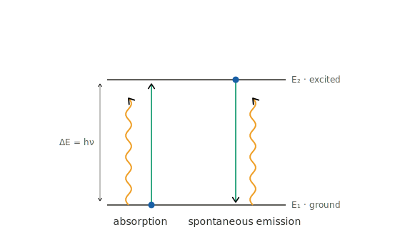
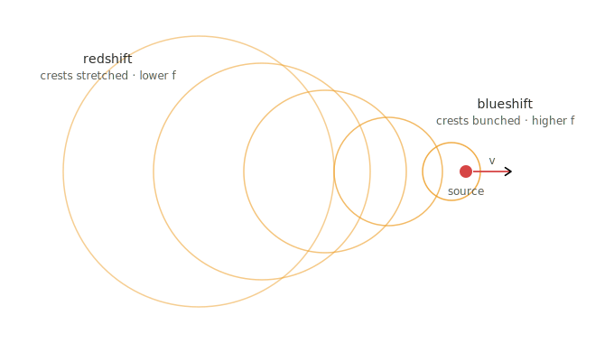
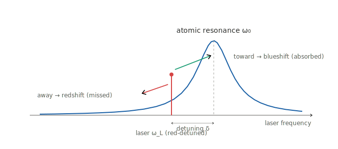
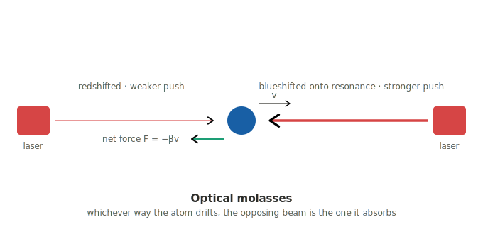

# Doppler cooling

## Part 1: the background

When you think about lasers irradiating a surface or object, typically you expect that the object will heat up.
This is a reasonable assumption for most cases. However, there is also a way to cool atoms close to absolute zero using
one or more lasers. I'll first give a super quick primer on atomic transitions and the Doppler effect,
then we'll dive into the cooling method and explain why it works.

### Atomic transitions and photon absorption

Atoms have various intrinsic energy levels that their electrons can occupy. These form a discrete
ladder of levels, and electrons can jump up or down a rung. 
Atoms in general can absorb a photon of a certain frequency, provided the photon's frequency
matches the energy difference between two of the atomic energy levels. The photon absorption
transfers its momentum to the atom. If the photon was traveling in the same direction as the atom,
the atom gains momentum and travels faster. Since temperature is - roughly and simplistically speaking -
a measure of the speed of an atom, if the photon was traveling in the same direction as the atom
it will increase the "temperature" of the atom. The atom will eventually and spontaneously
re-emit a photon in a random direction. The emitted photon will provide a kick in the opposite
direction of the photon emission (conservation of momentum). So if the photon emits "backward" with 
respect to the atom, the kick will increase the speed and temperature of the atom further.

The opposite goes for the case where there's a head-on collision between the photon and the atom.
This will happen if the photon and atom are initially traveling in opposite directions. This will
_decrease_ the speed and temperature of the atom. So if we want to cool a group of atoms zipping around
in space we'll want those head-on collisions to occur more frequently. How can we make that happen?

### The Doppler effect

The Doppler effect as applied to light waves and photons is a phenomenon that occurs from the point of view
of an "observer" observing light traveling through space. If the light is traveling toward the observer,
the observer will perceive an upward frequency shift as the wavefronts bunch up.

The opposite will occur if the light is moving away - the perceived frequency is lower (redshift).
So... how can we exploit this and the above to cool a collection of atoms?

### Putting it all together

If we have a laser that is shining light on the atoms from one direction,
if we exactly match an atomic transition, we might be equally likely to speed up atoms
(moving away from the laser) as slowing them down. Thus, no net cooling effect.

On the other hand, what if we tune the laser's frequency (photons' frequencies) to be a bit _below_
the atom's transition energy (spacing between atomic energy levels)? In that case, it's far more likely
for atoms traveling toward the laser light source to absorb the photon and get slowed down. This will serve 
to cool the atom. This happens due to the Doppler effect - atoms traveling toward the light source see
a blueshifted photon frequency, which shifts the photon's frequency up to match the atomic transition.
The photons traveling in the opposite direction will see a redshifted photon, and therefore
the frequency will be even lower than the atomic spacing → no absorption occurs.

Eventually the atoms will be traveling much more slowly and so the laser's frequency will need to be tuned
down even further, as the Doppler effect is less pronounced as the atoms get slower and cooler. If you keep
tuning the laser down, you can get those atoms extremely cold, and extremely close to absolute zero temperature. In
the next post I'll walk through the math, which will only require high school-level geometry.

This can be extended to multiple lasers pointing in different, opposite and orthogonal directions. That way
atoms moving away from one laser will be likely to absorb a photon from an opposite-pointing laser.

The full source for this series is on
[GitHub](https://github.com/kareanra/physics-blog).
The derivations, code, and prose are all mine. However, I did consult Claude to proofread and for help
setting up the project and rendering equations.
