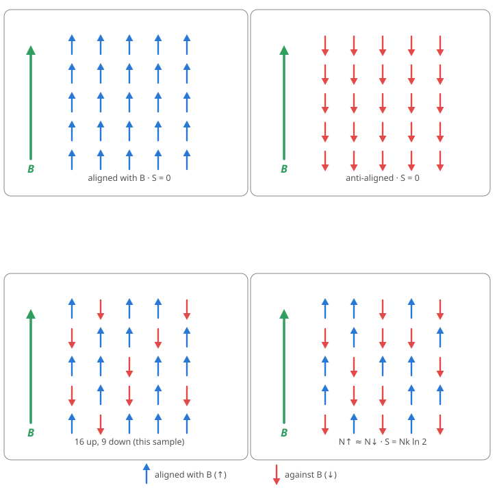
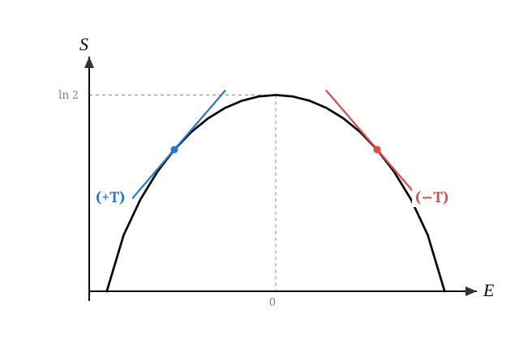

# Going below absolute zero

## Entropy

Before we get to what temperature is in the precise, thermodynamic sense, let's take a detour and describe what is
meant by the _entropy_ (designated `S`) of a physical system.

### The rough description

Entropy is a number (really a function of different parameters of the system in question) that - roughly speaking - 
describes the relative _order_ or _disorder_ of the system. You can think of a high-entropy system as one in which
things are a bit messy/chaotic/"random." A "toy model" example of this is if you take a box of legos and scatter them
all over the floor. Now imagine you fit them together and stack them neatly. This is a lower-entropy state. There
is more of a pattern, more order. And - importantly for the next step - there are fewer ways to stack them together
than there are configurations where the blocks are scattered on the floor.

### The slightly more precise definition

At the end of the rough case we alluded to "configurations." Well entropy in a more precise sense is related to,
and (kind of) proportional to the number of possible configurations for a particular system state. What state means
is a bit nebulous, but we'll come back and up the precision. For now let's be content with the state of our system
being the number of lego blocks, with the configurations being the orientation in space (on the ground). Clearly,
there are many more possible configurations for the non-stacked case. If you have 10 lego blocks, the fully-stacked
state - assuming each block is treated as "unique," perhaps identifiable by its color - the total number of ways
you can stack them vertically is 10 factorial. That's a huge number, but far, far less than the number of ways
to haphazardly arrange them in a more "random" way.

So the main takeaway for this section: low entropy = more order, high entropy = less order, more randomness. 

### Magnets in a magnetic field

Now let's extend the analogy to a 2-D grid of magnets. For the sake of this experiment, let's assume they are
only allowed to point up (North pole facing up) or down (North pole down, South pole up). Also assume that the
magnets don't interact with each other. They are effectively insulated from one another. We'll revisit the case
later of magnets that interact with their left, right, up, and down neighbors on the grid.

Okay, non-interacting magnets arranged in an equally spaced grid, initially randomly oriented either up or down.
The entropy of this system can be calculated directly, and it's based on (note the ambiguous wording) the number
of magnets pointing up versus down. The minimum entropy states are those in which all magnets point in the same
direction. Clearly there are two such points: all North poles facing up and all facing down (see figure).

The highest-entropy state can be calculated using combinations (from combinatorics: you might have heard about or
studied permutations and combinations). It turns out to be the state where exactly _half_ of the magnets are up and
half are down. There are many, many ways to scramble these across the grid (see figure), versus _one_ way of 
having them all face up (see figure).



## Energy

Energy is one of the most ubiquitous concepts in physics. It appears in almost every subfield. And yet, it's very
hard to actually define. It is fairly context-dependent, and often the basis for starting a physical calculation.
For our case of magnets in a magnetic field, I didn't say anything about the magnetic field in the entropy discussion.
It comes in now when discussing the energy of a configuration (with configuration = number of upward-facing magnets).
We know what the entropy is, but what is the energy?

Energy in a gas full of particles zooming around at high speed is the sum of all the individual
particles' kinetic energy. The higher the velocity, the higher the energy. So in general
when you add heat to a system, it will increase the energy, velocity of the particles,
and the entropy (the zooming gets faster and tends to mix the gas up more → more disorder). This last point is
important: in almost all systems, entropy _increases_ with energy.
We'll see that this is not true of our magnet system, though.

An ideal gas exhibits the usual behavior: entropy climbs with energy → temperature is always positive.

```{python}
#| label: fig-ideal-gas
#| fig-cap: "Entropy vs. energy for a monatomic ideal gas (Sackur-Tetrode). The slope at any point is $1/T$, and it never reaches zero, so the temperature is positive at every energy."
#| code-fold: true
import matplotlib.pyplot as plt
import ideal_gas

fig, ax = plt.subplots(figsize=(8, 4.2))
ideal_gas.draw_entropy_vs_energy(ax)
plt.show()
```

The only systems that can achieve a negative temperature are those which have an upper bound to the energy
the system can take on. A gaseous cloud of particles can always become more energetic, ad infinitum. There is
no upper bound, and thus no way to get the temperature negative.

Going back to the magnets in the grid, let's assume the magnetic field is oriented in the upward direction
in our grid, as in the figure above. When that's the case, the magnets will 
tend to orient themselves in the same direction as the magnetic field. This is the lowest-energy state: 
all magnets facing upward. We know the entropy of this state is exactly 0 (entropy, being proportional technically
to the _natural logarithm_ of the number of configurations, of which there is exactly 1: all magnets
pointing up). So what is the energy?

The energy of a single magnet in a magnetic field turns out to be directly proportional to the strength of the magnetic
field and the orientation of the single magnet. The energy of a single magnet is

$$
E_i = -\mu s_i B = \pm \mu B
$$

$$
E_{total} = -\mu B (s_1 + s_2 + s_3 + ...)
$$

where $B$ is the magnetic field strength, $s_i$ is the direction the magnet is pointing, 1 for up and -1 for down
and $\mu$ is a proportionality constant (a number that multiplies $B$). The minus sign in there
indicates that lower energy (favorable) orients the magnet in the same direction
as the magnetic field. The second equation shows that the total energy of the grid of magnets
is just the sum of the individual energies.

For the sake of this discussion it suffices to state that the energy of a single magnet
is directly proportional to the direction of the magnet along with the magnetic field strength.

The high-energy case for a given magnetic field strength occurs when all magnets
point down. The low-energy case is that in which all are pointed up.

## Temperature: the thermodynamic definition

The temperature of a gas in a big container is directly proportional to its energy.
As we saw before energy scales (quadratically) with the gas particles' velocities.
So heating a gas will cause the energy to increase and the particles to zoom around
faster.

You may be familiar with the Kelvin scale of temperature, for which the 0 point is the "minimum" temperature,
at which all atomic motion stops (quantum mechanics and zero-point energy have entered the chat). Systems
are not supposed to be able to go below absolute zero. After all, what would that mean for the atoms, which are
already frozen and motionless?

Let's go back to our magnet system. In our system it would seem temperature is not super relevant. How does it
enter into the picture?

It turns out that the precise definition (in the thermodynamic sense) of the
temperature of a system is the *inverse of the rate of change of entropy
with energy*. For those who have studied calculus:

$$
\frac{1}{T} = \frac{dS}{dE}
$$

That definition is a mouthful, so let's unpack it. The rate of change of
entropy with respect to energy means, roughly: if you increase the energy of your
system, does the entropy go up or down? If it goes up, the sign of the right
side of the equation is positive → temperature is positive. This is the
case for nearly every physical system. Increases in energy increase the entropy.
And lowering the energy lowers the entropy (aside: this is why it's so much easier to heat
things than to cool them - entropy wants to increase in general, so you're fighting
the second law of thermodynamics by cooling something and decreasing its entropy).

On the other hand, if the rate is negative, which is to say that the entropy
decreases with increasing energy, that means our system has _negative_ temperature.
This doesn't mean on the Fahrenheit or Celsius scale, how the weather often goes
"below zero" in New England in the winter. It's temperature measured in Kelvin,
with $0K$ meaning the absolute minimum achievable temperature (until a magnetic grid
like this was theorized and experimented with). So in general you can get crazy, crazy
close to absolute zero, but you can't get below it.

So all we need in order to get a negative temperature is to show that the entropy
our system, in certain configurations, scales inversely with energy. Or put simply,
if we add energy to the system it becomes more ordered.

## Demonstration of negative T

In part 2 of this series we'll solve some actual equations and show that
temperature does dip below zero as our system absorbs and releases energy.
For now, let's skip to the punchline and look at the curve showing
entropy as a function of energy. The slope of the curve at each point
will give us the sign of the temperature. If the slope is positive,
we're at a positive temperature. When the slope is negative, the temperature
is negative.



## Energy (heat) flow

The last thing I'll highlight here is that in all positive-temperature systems - which as we said is nearly all -
if you put it in contact with another system, the hotter system will transfer energy, possibly in the form of
heat, to the colder one. _However_, a negative-temperature system will actually transfer heat to an already-hotter
system! That's pretty wild, if you ask me.

Okay, that's all for now. In part 2 I'll get into a derivation of this and demonstrate a rigorous result.


The full source for this series is on
[GitHub](https://github.com/kareanra/physics-blog).
The derivations, code, and prose are all mine. However, I did consult Claude to proofread and for help
setting up the project and rendering equations.
